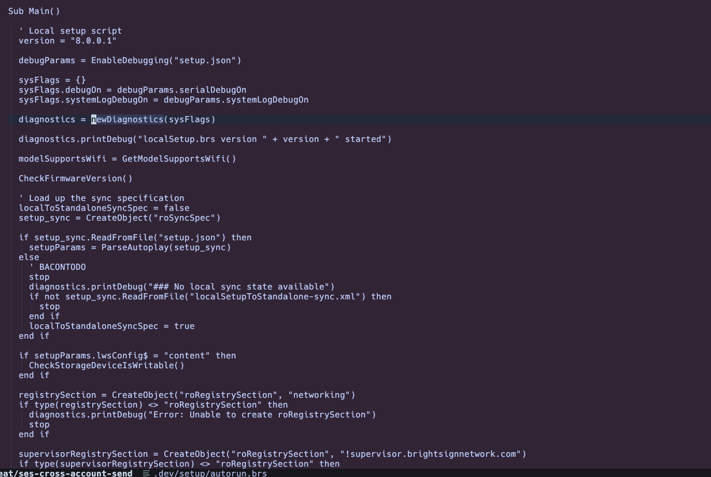
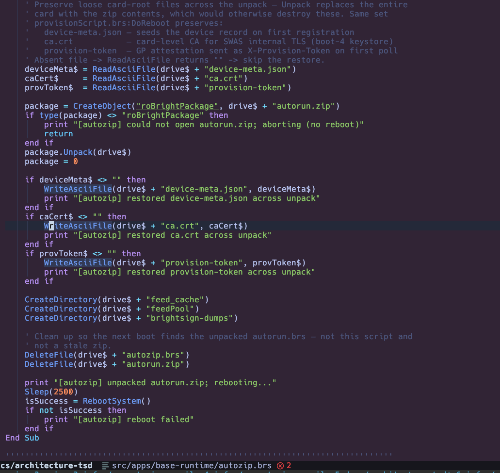
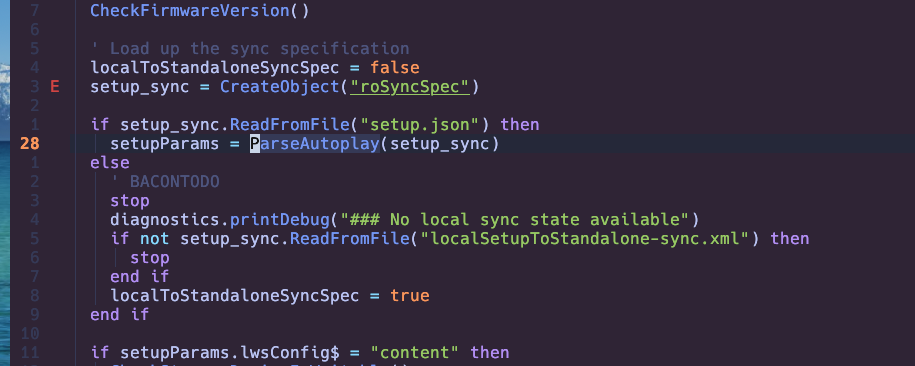
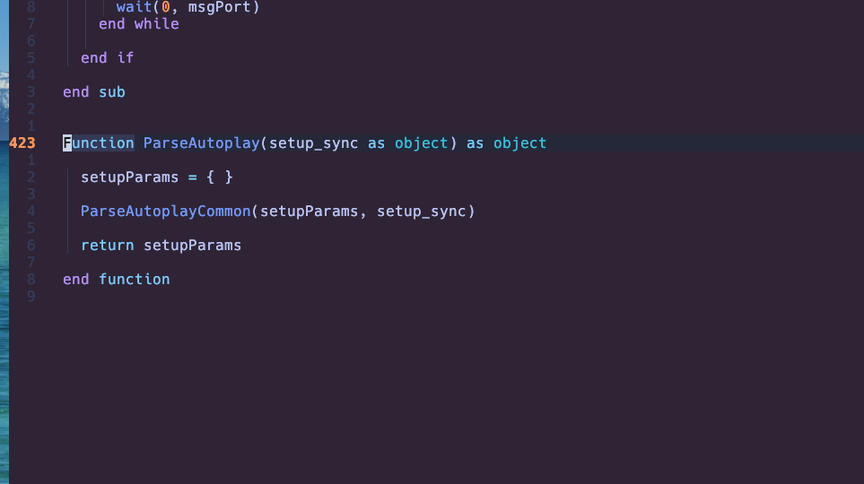

# brighterscript.nvim

[BrightScript](https://developer.roku.com/docs/references/brightscript/language/brightscript-language-reference.md)
/ BrighterScript support for Neovim — syntax highlighting and LSP for Roku and BrightSign `.brs` files.

- **Syntax highlighting** — a self-contained vim syntax file (`*.brs`, `*.bs`). No
  Tree-sitter parser or external grammar required.
- **LSP** — wraps RokuCommunity's [`brighterscript`](https://github.com/rokucommunity/brighterscript)
  language server (`bsc --lsp --stdio`): diagnostics, completion, hover, goto-definition,
  rename, and document symbols.
- **Formatting** — via RokuCommunity's [`bsfmt`](https://github.com/rokucommunity/brighterscript-formatter)
  CLI, wired through a formatter runner — see [Formatting](#formatting).

Requires **Neovim 0.11+** (native `vim.lsp.config` / `vim.lsp.enable`). No `nvim-lspconfig`
or `mason` dependency.

> The LSP is provided by RokuCommunity's
> [brighterscript](https://github.com/rokucommunity/brighterscript); this plugin is the
> Neovim glue (filetype, syntax, and server registration).

### Before / after

The same BrightSign script with the plugin disabled and enabled:

| Plain text (no plugin) | With `brighterscript.nvim` |
|:---:|:---:|
|  |  |

> Highlighting and live LSP diagnostics on a BrightSign `.brs` script. The two flagged
> lines are the expected Roku-vs-BrightSign false positives — see [BrightSign caveat](#brightsign-caveat).

### Go to definition

`gd` jumps to a symbol's definition, across files — here from a call to its function:

| Call site (`gd` here) | Jumps to definition |
|:---:|:---:|
|  |  |

Your own symbols resolve, including functions attached to objects (e.g. `diagnostics.printDebug`
finds the global `PrintDebug` sub). Engine/SDK built-ins (`CreateObject`, `print`, `wait`,
BrightSign `ro*` objects) don't — they have no source to open, and nothing needs adding.

> **Member-access gotcha:** on an `obj.method` call, `bsc` returns nothing when the cursor sits
> on the *first* character of the member name (right after the `.`). Put the cursor one column
> into the identifier and it resolves. Bare global names (`newDiagnostics`) don't have this.

Cross-file resolution needs a project root the server can scope. A `.git`, `manifest`, or
`bsconfig.json` is enough; if your scripts live outside `source/`, point a `bsconfig.json` at
them (see [BrightSign caveat](#brightsign-caveat)).

## Install the `bsc` binary

Either source works; the plugin resolves `bsc` from `$PATH` first, then Mason's bin dir.

```sh
npm install -g brighterscript      # global
# or, with mason.nvim:
:MasonInstall brighterscript
```

## Setup (lazy.nvim)

```lua
{
  "Kblack0610/brighterscript.nvim",
  ft = "brightscript",
  init = function()
    -- ensure .bs also resolves to the brightscript filetype before the ft-load fires
    vim.filetype.add({ extension = { bs = "brightscript" } })
  end,
  opts = {},
}
```

`opts` is passed to `require("brighterscript").setup()`:

| key | default | meaning |
|---|---|---|
| `cmd` | auto (`bsc --lsp --stdio`) | override the server command |
| `filetypes` | `{ "brightscript", "brs", "bs" }` | filetypes the LSP attaches to |
| `root_markers` | `{ "bsconfig.json", "manifest", ".git" }` | project root detection |
| `auto_enable` | `true` | register and enable the server |
| `on_attach` / `capabilities` / `settings` | `nil` | standard LSP overrides |

Completion capabilities and keybindings normally come from your global
`vim.lsp.config("*", { capabilities = ... })` and an `LspAttach` autocmd, so you don't
need to repeat them here.

## Highlighting and the LSP are independent layers

Highlighting and the language server are separate systems:

- **Base colors** come from the bundled vim syntax file, not the LSP. They render with the
  LSP stopped or with `bsc` not installed.
- **The LSP** (`bsc`) adds semantic-token highlighting (parse-aware coloring) plus
  diagnostics, completion, hover, goto-definition, rename, and symbols.

Turning off the LSP does not remove the colors; the syntax file still applies. The toggles
are independent:

```vim
" diagnostics only (colors stay):
:lua vim.diagnostic.enable(false)        " back on: vim.diagnostic.enable(true)

" syntax-file colors (this buffer):
:setlocal syntax=OFF                     " back on: :setlocal syntax=brightscript
```

For a monochrome buffer, disable the syntax and detach the LSP (which also removes its
semantic-token colors):

```vim
:setlocal syntax=OFF
:lua vim.lsp.enable("brighterscript", false)
:lua for _, c in ipairs(vim.lsp.get_clients({ name = "brighterscript" })) do vim.lsp.stop_client(c.id) end
```

### Highlighting only (no LSP)

The vim syntax file is self-contained, so the plugin gives you **syntax highlighting on its
own** — no `bsc`, no Node, nothing else to install. Just install the plugin and skip the
`bsc` step above:

```lua
{
  "Kblack0610/brighterscript.nvim",
  ft = "brightscript",
  init = function()
    vim.filetype.add({ extension = { bs = "brightscript" } })
  end,
  opts = {},
}
```

Without `bsc` on `$PATH` the LSP simply stays inactive (it logs a clear error and the syntax
colors still apply). Or, to vendor the highlighting with no plugin at all, copy
`syntax/brightscript.vim` and `ftdetect/brightscript.vim` into your config's `syntax/` and
`ftdetect/` directories.

## Formatting

The `brighterscript` language server provides no LSP formatting, so formatting comes from
RokuCommunity's separate [`bsfmt`](https://github.com/rokucommunity/brighterscript-formatter)
CLI. Install it, then point a formatter runner at it:

```sh
npm install -g brighterscript-formatter   # or :MasonInstall brighterscript-formatter
```

With [conform.nvim](https://github.com/stevearc/conform.nvim):

```lua
require("conform").setup({
  formatters_by_ft = {
    brightscript = { "bsfmt" },
  },
  formatters = {
    bsfmt = {
      command = "bsfmt",
      args = { "--write", "$FILENAME" },  -- bsfmt has no stdin; format the tempfile in place
      stdin = false,                      -- conform reads the file back after --write
    },
  },
})
```

`bsfmt` honors a project `bsfmt.json` for style options. If `bsfmt` isn't on your `$PATH`,
install it via Mason (above) — `mason.nvim` prepends its `bin/` to Neovim's `PATH`, so
conform finds it.

## BrightSign caveat

The `brighterscript` engine models **Roku's** standard library. Syntax errors, formatting,
and navigation/hover/rename/completion on your *own* symbols are accurate. *Semantic*
diagnostics, however, will flag BrightSign-specific objects (`roVideoPlayer`,
`roNetworkConfiguration`, `roBrightPackage`, …) as unknown functions/components.

To suppress these in a BrightSign project, add a `bsconfig.json` at the project root:

```json
{ "diagnostic": { "suppress": ["1001"] } }
```

(`1001` = "cannot find function"). Real syntax errors still surface.

### Scripts outside `source/`

BrightScript shares function symbols only within one global scope (`pkg:/source/**`). If your
scripts live elsewhere (e.g. a `deploy/` or `.dev/setup/` directory), the server loads each
file as an isolated single-file project and cross-file `gd` finds nothing. Point a
`bsconfig.json` (next to the scripts, or at the project root) at them and remap into `source/`
so they share one scope:

```json
{
  "files": [
    { "src": "**/*.brs", "dest": "source/" },
    { "src": "**/*.bs",  "dest": "source/" }
  ]
}
```

Exclude any bundled/generated `.brs` that redefines the same functions (it would collide),
e.g. add `"!pending-autorun.brs"` to `files`.

## Credits

- [rokucommunity/brighterscript](https://github.com/rokucommunity/brighterscript) — the
  language server (`bsc`) behind the LSP features.
- [rokucommunity/brighterscript-formatter](https://github.com/rokucommunity/brighterscript-formatter)
  — the `bsfmt` formatter.
- [RokuCommunity.brightscript](https://marketplace.visualstudio.com/items?itemName=RokuCommunity.brightscript)
  — the VS Code extension this plugin mirrors for Neovim.
- Developed for the BrightSign fleet manager at
  [Gigantic Playground](https://giganticplayground.com).

## License

MIT
